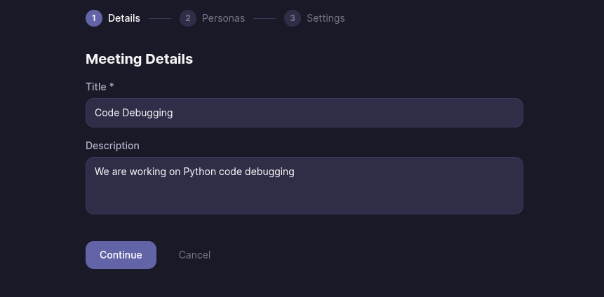
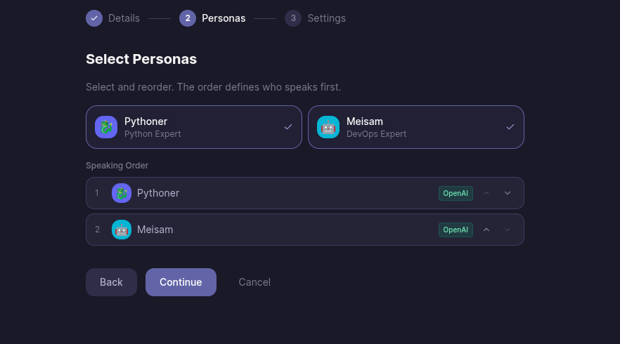
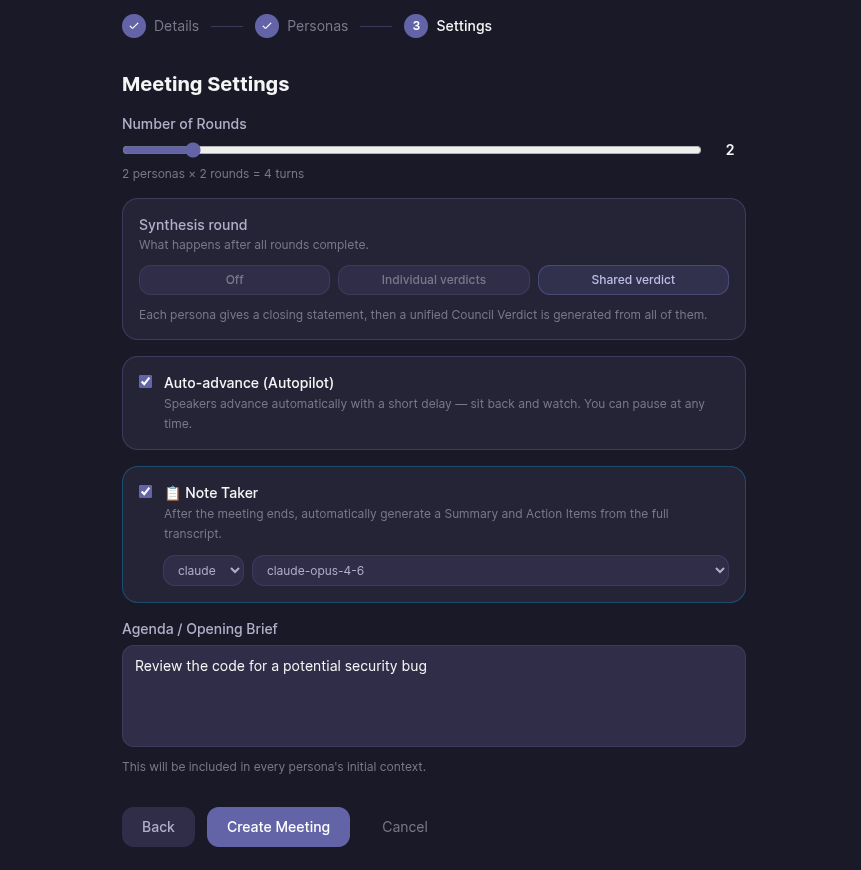

# 🏛️ AI Council

> **Pit Claude, GPT-4, Gemini, and local Llama models against each other — on any topic.**

[](https://opensource.org/licenses/MIT)
[](https://nextjs.org/)
[](https://react.dev/)
[](https://tailwindcss.com/)

**AI Council** is a blazing-fast, open-source platform for running structured multi-LLM debates. Build a diverse cast of AI personas, back them with different state-of-the-art models, inject unique system prompts, and watch them argue, challenge each other, and converge on a verdict—all streaming live in your browser.

🔒 **Privacy First**: API keys *never* leave your browser. Zero backend, zero database. All data is persisted locally.

---

## 📸 What it looks like

### Creating a meeting — 3 steps

**Step 1 — Set the topic**



**Step 2 — Pick your personas and set the speaking order**



**Step 3 — Configure rounds, synthesis mode, Autopilot, and Note Taker**



Hit **Create Meeting** and watch the council debate live.

---

## 🚀 Why use AI Council?

A single LLM gives you one perspective. **AI Council gives you a think tank.** 

Different models have genuinely different priors. A cautious Claude persona hedges, an aggressive GPT-4 pushes forward, and a local Llama provides a contrarian angle. By forcing them into structured rounds with domain discipline, you surface deep insights you'd never get from a single prompt.

**🔥 Killer Use Cases:**
- 🏗️ **Architecture Reviews:** Stress-test system decisions.
- 🕵️ **Code Bug Hunts:** Pit a Coder vs. a Security Auditor.
- 😈 **Product Planning:** A "Devil's Advocate" attacking a "Product Manager".
- 🤝 **Hiring Rubrics:** Run candidate profiles through a tough council panel.
- 🏛️ **Philosophy/Ethics:** Historical archetypes debating modern dilemmas.

---

## ✨ Features

- **🧠 Multi-Model Mastery:** Mix Claude, GPT-4, Gemini, and local Ollama models in the same debate seamlessly.
- **🔄 Structured Rounds:** Perfect order, full context history, no interruptions.
- **🗣️ @Mentions:** Tag a persona mid-meeting for an immediate, targeted response.
- **📝 Synthesis & Note Taker:** Choose between individual closing statements, a unified council verdict, or deploy an independent AI observer to log key insights.
- **🪄 Auto-Prompting:** Describe a persona, and Claude automatically generates the perfect, highly-tuned system prompt.
- **🛡️ Domain Discipline:** Personas are algorithmically forced to stay entirely within their designated lane.
- **🏎️ Autopilot:** Let the council debate overnight with zero clicks required.
- **💾 Local-First & Exportable:** Everything runs in `localStorage`. Export debates perfectly to Markdown or JSON.

---

## 📦 Quick Start

Get your council running locally in under 60 seconds:

```bash
git clone https://github.com/meisamsharahi/aiCouncil.git
cd ai-council
npm install
npm run dev
```

Open [http://localhost:3000](http://localhost:3000)

⚙️ **Setup**: Go to **Settings**, paste your API keys (Anthropic, OpenAI, or Google) or link your local Ollama instance, and start your first debate!

---

## 🤖 Supported Models

| Provider | Example Models |
|---|---|
| **🟠 Anthropic (Claude)** | `claude-opus-4-6`, `claude-sonnet-4-6`, `claude-haiku-4-5` |
| **🔵 OpenAI** | `gpt-4o`, `gpt-4o-mini`, `o3-mini` |
| **🟡 Google (Gemini)** | `gemini-2.5-pro`, `gemini-2.0-flash` |
| **🦙 Ollama (Local)** | `llama3.3`, `mistral`, `deepseek-r1`, `qwen2.5-coder` |

*Mix and match any of these inside the same meeting!*

---

## 🛠️ Tech Stack

Built for speed, scale, and Developer Experience (DX):

- ⚡ **Next.js 15** (App Router)
- 💎 **React 19**
- 🛡️ **TypeScript** (Strict Mode)
- 🐻 **Zustand** (Local storage persistence)
- 🎨 **Tailwind CSS** (Premium Dark Mode UI)
- 📡 **Server-Sent Events (SSE)** (Real-time token streaming)

---

## 🤝 Contributing

We love contributions! Before jumping in:
1. Check [IMPROVEMENTS.md](IMPROVEMENTS.md) for the active backlog (Context window pruning is our #1 priority!).
2. Open an issue to discuss non-trivial changes.
3. Keep PRs focused and atomic.

---

## 🗺️ Roadmap

- [ ] ✂️ Context window pruning for long meetings
- [ ] 🔗 Shareable read-only meeting permalinks
- [ ] 📚 Persona library (Import/Export)
- [ ] 🔀 Branching (Re-run a round with different personas from the same history)
- [ ] 🎙️ Voice output (ElevenLabs / Web Speech API Integration)

---

### 📜 License
Released under the **MIT License**.
